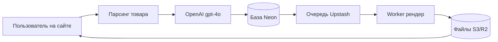
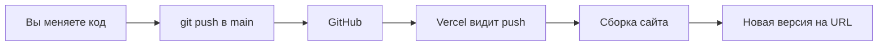

# Reels Factory — простой пайплайн + автодеплой (без тестов на своём ПК)

## Главная идея

Вы **не запускаете** сайт у себя на компьютере (без `npm run dev`, без Docker).

Вместо этого:
1. Код лежит на **GitHub**
2. При каждом обновлении кода Vercel **сам** собирает и публикует сайт
3. Тестируете только **готовую ссылку** в браузере (с телефона или ПК)

Репозиторий уже есть: [https://github.com/gdebudem/reelsfactory](https://github.com/gdebudem/reelsfactory)

Сайт на Vercel (после исправления деплоя): **https://web-omega-ochre-29.vercel.app**

---

## Что делает пользователь на сайте (5 шагов продукта)

1. Вставляет ссылку на товар
2. Отвечает на 4 вопроса (тип ролика, акценты, куда вести клиента)
3. Нажимает «Создать видео»
4. Видит статус: готовится → готово
5. Скачивает MP4

---

## Что происходит «под капотом» (5 технических шагов)

### Шаг 1. Забираем данные о товаре (без нейросети)

С страницы товара получаем: название, цену, фото.

### Шаг 2. OpenAI пишет текст ролика (единственный шаг с ИИ)

- Сервис: **OpenAI**
- Модель: **gpt-4o**
- Запрос: «напиши сценарий ролика» → ответ в формате **JSON** (заголовок, CTA, сцены по секундам)

### Шаг 3. Сохраняем заказ в облачную базу

Запись «задача на ролик» с номером (jobId).

### Шаг 4. Ставим задачу в очередь на сборку видео

Отдельный сервис (worker) забирает задачу и собирает MP4.

### Шаг 5. Отдаём ссылку на готовый ролик

Пользователь видит плеер и кнопку «Скачать».



---

## Какие внешние сервисы нужны (всё в облаке)

| Сервис | Зачем | Нужен Docker на ПК? |
|--------|--------|---------------------|
| **GitHub** | Хранение кода, автодеплой | Нет |
| **Vercel** | Сайт + API (визард, парсинг, OpenAI) | Нет |
| **Neon** | База данных (задачи, пользователи) | Нет |
| **Upstash** | Очередь для рендера | Нет |
| **Cloudflare R2** или S3 | Хранение готовых MP4 | Нет |
| **OpenAI** | Текст сценария | Нет |
| **Railway / Fly.io** | Worker (сборка видео) | Нет |

Локальный Docker **не нужен**.

---

## Какие API OpenAI понадобятся

Один тип запроса:

- Адрес: `https://api.openai.com/v1/chat/completions`
- Модель: `gpt-4o`
- В ответе — JSON со сценарием ролика

Ключ задаётся в настройках Vercel: переменная `OPENAI_API_KEY`.

---

## Автодеплой: GitHub + Vercel (пошагово)

### Часть A. GitHub (один раз)

1. Все изменения в папке `c:\cursor\reels factory` сохраняются в Git.
2. Отправка на GitHub:
   ```bash
   git add .
   git commit -m "описание изменений"
   git push origin main
   ```
3. Репозиторий: `https://github.com/gdebudem/reelsfactory.git`

**После настройки:** каждый `git push` в ветку `main` — это новая версия кода на GitHub.

### Часть B. Vercel (один раз подключить репозиторий)

1. Зайти на [vercel.com](https://vercel.com) → войти через GitHub.
2. **Add New Project** → выбрать репозиторий `gdebudem/reelsfactory`.
3. Важные настройки сборки:
   - Сборка идёт **из корня репозитория** (у нас есть [vercel.json](vercel.json) в корне).
   - Не указывать вручную «Output Directory» как `.next` в корне — иначе будет ошибка 404 на сайте.
4. Добавить переменные окружения в Vercel (Settings → Environment Variables):

| Переменная | Значение | Зачем |
|------------|----------|--------|
| `NEXTAUTH_SECRET` | длинная случайная строка | безопасность входа |
| `NEXT_PUBLIC_APP_URL` | `https://web-omega-ochre-29.vercel.app` | ссылки на сайте |
| `SKIP_PAYMENT` | `true` | пока без Stripe |
| `OPENAI_API_KEY` | ваш ключ OpenAI | реальные сценарии |
| `DATABASE_URL` | строка из Neon | сохранение задач |
| `REDIS_URL` | строка из Upstash | очередь рендера |

5. Нажать **Deploy**.

### Часть C. Автодеплой (как это работает дальше)



**Правило:** сделали `git push` → через 1–3 минуты на Vercel появляется новая версия. Ничего вручную на Vercel нажимать не нужно.

Проверка: Vercel → проект `web` → вкладка **Deployments** → последний статус **Ready**.

---

## Как тестировать БЕЗ локального компьютера

1. Открыть сайт: **https://web-omega-ochre-29.vercel.app**
2. Перейти в «Создать ролик».
3. Вставить ссылку на товар → «Подтянуть».
4. Пройти 4 шага → «Создать видео».
5. Дождаться статуса «Готово» и скачать MP4.

Если ошибка «Не удалось создать задачу» — в Vercel не заданы `DATABASE_URL` и `REDIS_URL` (нужны Neon + Upstash, см. ниже).

---

## Облачная инфраструктура для полного пайплайна (без Docker)

### 1. Neon (база данных) — 5 минут

1. [neon.tech](https://neon.tech) → создать проект.
2. Скопировать `DATABASE_URL`.
3. Вставить в Vercel → Environment Variables.
4. Один раз применить схему таблиц (можно через Neon SQL Editor или с любого ПК командой `npm run db:push` с этим URL — **не обязательно держать Docker**).

### 2. Upstash (очередь) — 5 минут

1. [upstash.com](https://upstash.com) → Redis → создать базу.
2. Скопировать `REDIS_URL`.
3. Вставить в Vercel.

### 3. Worker (рендер видео) — отдельно от Vercel

Vercel **не умеет** долго собирать видео (нужны минуты и FFmpeg).

План:
- Развернуть `apps/worker` на **Railway** или **Fly.io**.
- Туда же: `DATABASE_URL`, `REDIS_URL`, `OPENAI_API_KEY`, настройки S3/R2.

Пока worker не развёрнут: сценарий и сайт работают, но MP4 может не появиться (зависнет на «в очереди»).

### 4. Хранилище MP4 (R2 или S3)

- Cloudflare R2 или AWS S3 — для готовых файлов.
- Переменные `S3_*` в worker и при необходимости в Vercel.

---

## Порядок внедрения (что делаем по очереди)

| Этап | Что делаем | Где тестируем |
|------|------------|----------------|
| 1 | Автодеплой GitHub → Vercel, лендинг + визард | URL Vercel | **сделано** |
| 2 | Подключить Neon + Upstash, переменные в Vercel | Создание задачи без ошибки |
| 3 | OpenAI `gpt-4o` в коде + `OPENAI_API_KEY` | Качество текста в ролике |
| 4 | Endpoint «одна кнопка» `POST /api/pipeline/run` | Упрощение UX |
| 5 | Worker на Railway/Fly + R2 | Полный MP4 в облаке |

---

## Что НЕ делаем на локальном ПК

- Не запускаем `docker compose`
- Не запускаем `npm run dev` для проверки (только если разработчик правит код)
- Не ставим Postgres/Redis локально

Всё тестирование — **только по ссылке Vercel** и в панелях Neon / Upstash / Vercel.

---

## Полезные ссылки в проекте

- Подробный деплой: [DEPLOY.md](DEPLOY.md)
- Конфиг Vercel в корне: [vercel.json](vercel.json)
